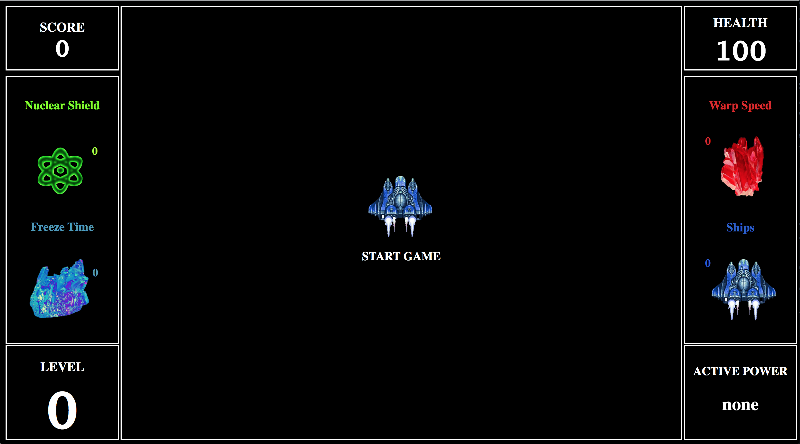
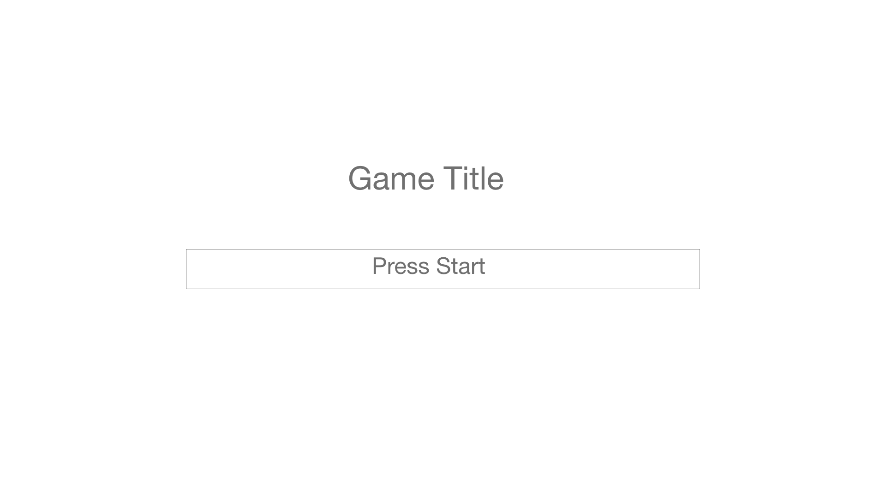
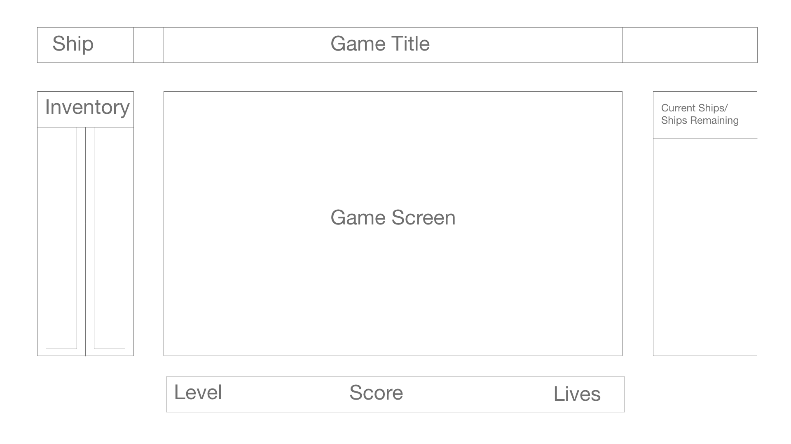

# Dropper
---
#####https://wileyjak3.github.io/Dropper/

 ### Dropper (Asteroid)
- Dropper: Several asteroids fall from the top of the screen, and the user must avoid them. The player ship can be controlled with the arrow keys. The longer the player lasts without being hit, the higher the score. As the level increases the asteroids get faster, larger, and increase in quantity.

### Controls:
- arrow keys to move up,down,left,and right
- "A" key to activate "freeze time" power-up
- "W" key to activate "Warp speed" power-up
- "S" key to activate "Shields" power-up"

### Rules of the game

  - Players press the arrows to control the spaceship and dodge the asteroids.
  - players can pick up power ups to utilize temporary abilities to help them survive the asteroid field.
   - Freeze Time: Stops the asteroids from moving on the page
   - Warp Speed: Slows down the asteroids 
   - Nuclear Shield: Makes you invulnerable to damage
  - The effects of the power ups are active as long as you see the    name of the power up under active powers.

###Technologies Used: 
   - Javascript
   - Html
   - CSS
   - jQuery

###Setup:
  go to the link and open the browser window to the full screen.

###Bugs:
- Nuclear Shield can go negative  if activated at 0.
- Power ups can't be activated at the same time.

### Technical Challenges (Dropper)
- canvas
- Grid w/Canvas

### Wireframe
Dropper start page:

Dropper wireframe:

### Timeline

 - Wednesday 
    - studied canvas
    
- Thursday:
   - studied canvas

- Friday:
  - Javascript

- Saturday:
  - Javascript

- Sunday:
  - Javascript/CSS

- Monday: 
  - CSS

##Credits
- Wiley Jackson III ( https://github.com/wileyJak3 )

